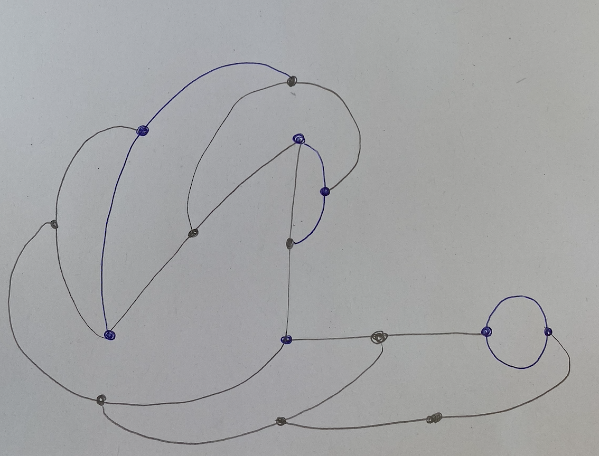

# Day 01 - Getting back into it

## Computing without computer
To start out, we made a few Conditional Designs with pen and paper. This helped me to get my mind back into understanding and thinking about how random things can turn out when certain conditions are given.

## Computing with computer
To get back into coding visuals, I started to draw some simple shapes with Three.js

<iframe src="content/day01/shapes/index.html" width="100%" height="450" frameborder="no"></iframe> 

Then I created a little spinning grid of random blocks.

<iframe src="content/day01/BlockyGrid/index.html" width="100%" height="450" frameborder="no"></iframe> 