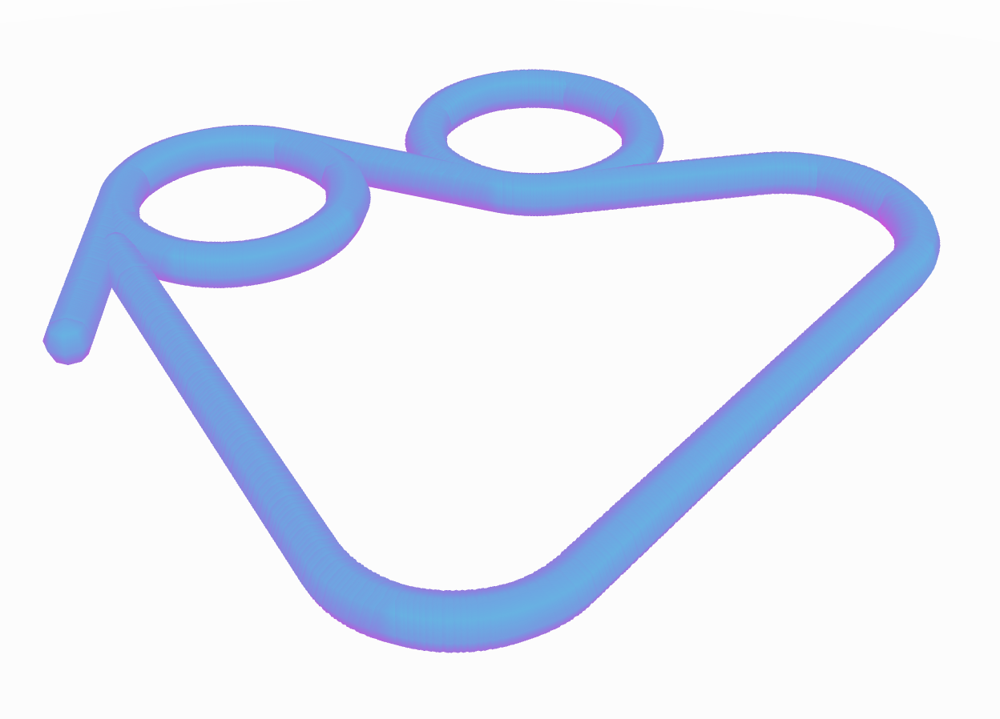
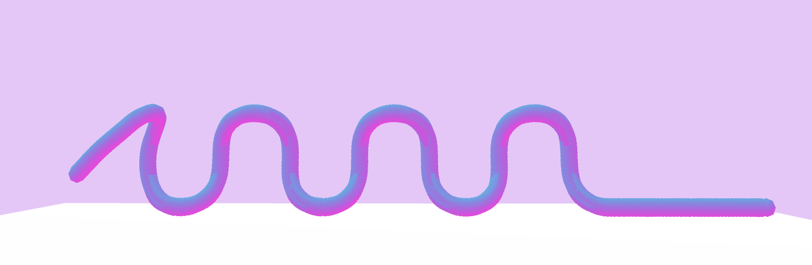

# Day 04 - Drawing machine

Today's theme is drawing machines. After a quick internet research, I only found 2D stuff. But since I am way more interested in 3D, I had to come up with something myself.
I started to think about how it would be possible to draw in 3D space. So I came up with the idea of flying around in first person view, and being able to leave behind a path. 

You can now fly inside a 50x50x50 cube. You constantly move forward. You can use WASD to fly rotate UP/DOW/LEFT/RIGHT. While pressing the space bar, you create the path.

On the left half of the screen, you can see the first person view in which you are drawing. On the right side, you can see the artwork from a stationary camera, which can be moved around with orbit control. (The performance might not be the best, sorry for that :/ )

## FlyToDraw

<iframe src="content/day04/flyToDraw/index.html" width="100%" height="450" frameborder="no"></iframe> 

[FullScreen](https://mattsymetry.github.io/GENCG/content/day04/flyToDraw/index.html)

## Examples

Here are some quick examples on what can be done:

