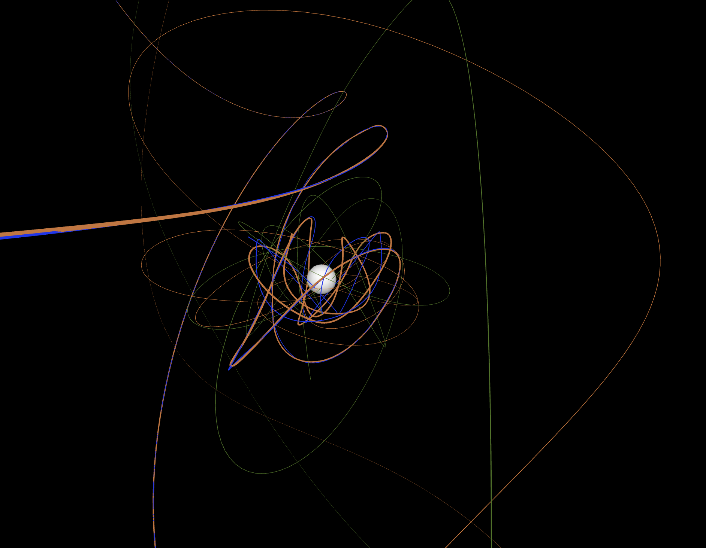
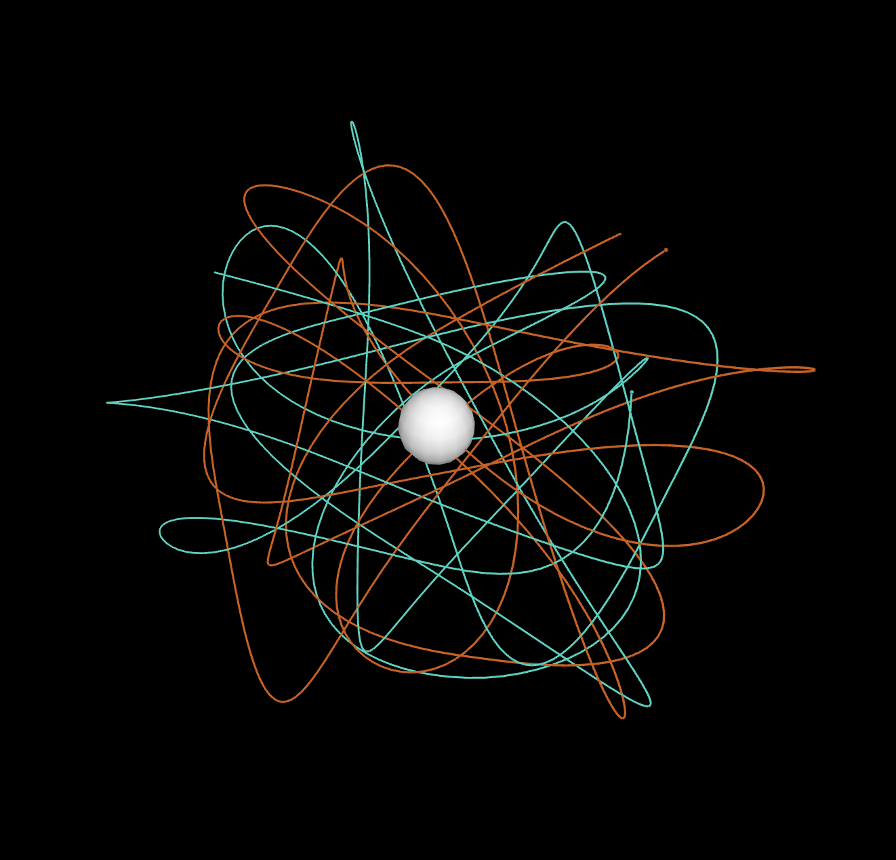
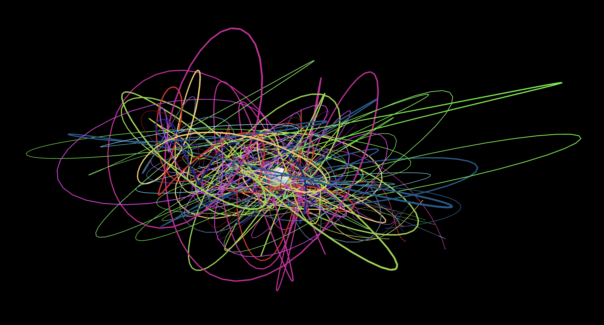

# Day 05 - Drawing with gravity

By reflecting and looking back on all the projects I've done in the past few days, I really enjoyed the idea of a drawing machine, but this time, letting the machine do all the work insted of drawing yourself.

The best/simplest way to draw in 3D space is to leave behind some sort of path. So the question now was, what objects will leave the path and why/how do they move?
I then remembered that some students created clocks with planets and a solar system. If I now take this concept into 3D space and let the planets move according to gravitational forces, I could let physics draw.

So I created a stationary big planet in the center of the scene. Now, I spawn in some random sized plantes at random positions around that stationary planet. Then I just "simulate" the paths of the planets according to the gravitational interactiones between all planets and draw out the paths as lines.

## Gravity

<iframe src="content/day05/gravity/index.html" width="100%" height="450" frameborder="no"></iframe> 

[FullScreen](https://mattsymetry.github.io/GENCG/content/day05/gravity/index.html)

## Examples

Here are some quick examples on what can be done:

