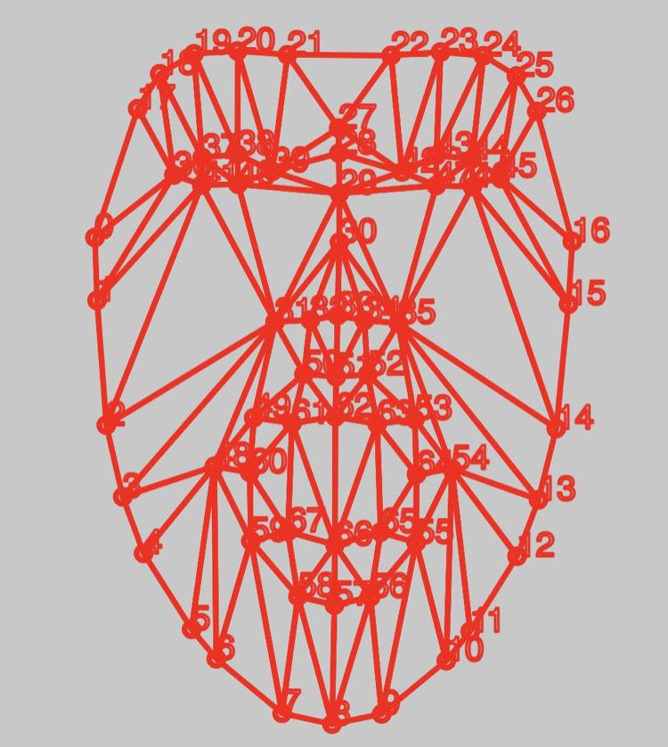
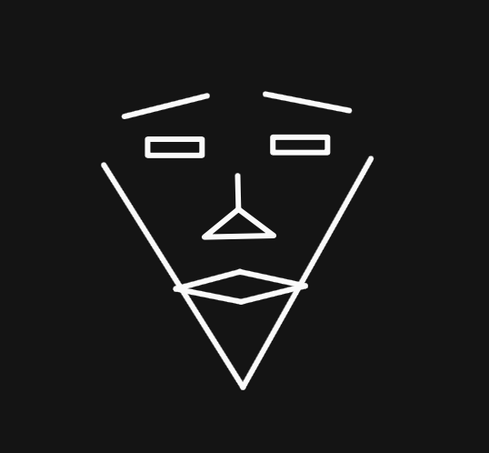
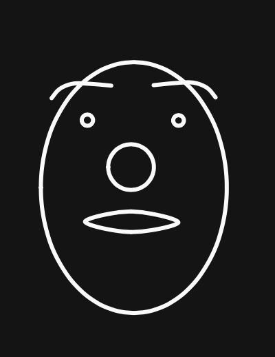

# Day 06 - Faces

When I first heard the theme, I honestly wasn't excited since I simply had no clue on what to do with it. But then Guillaume showed us the MediaPipe face-tracking library, and it instantly caught my attention.

Once that was up and running, I simply had a mask tracked on my face with some specific points. 

So I just thought it could be fun to create some sort of abstract faces by connection some of those given points.

I came up with 2 different face shapes, one looks like a triangle and the other one is made out of circles.

You can move around the canvas and save the position of the current face to create some sort of iterative image. Each time you save a face, you get a randomly chosen new face shape.


<iframe src="content/day06/abstractFaces/index.html" width="100%" height="450" frameborder="no"></iframe> 

[FullScreen](https://mattsymetry.github.io/GENCG/content/day06/abstractFaces/index.html)