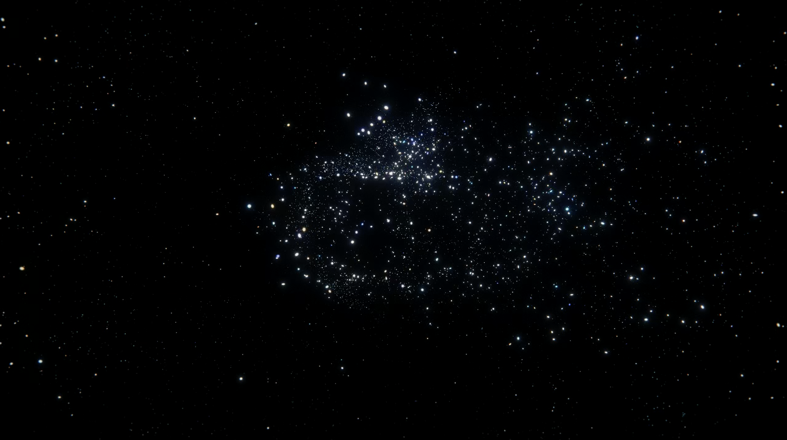
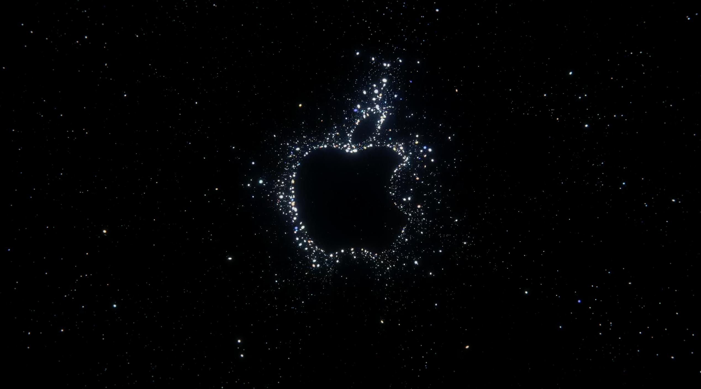
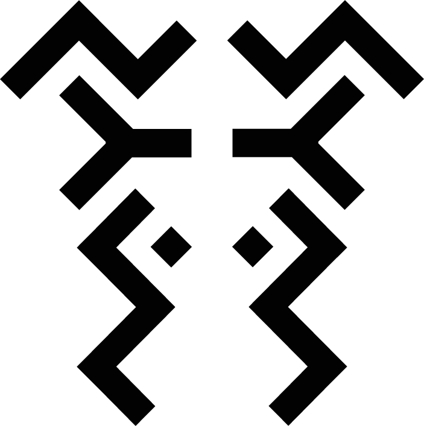

# Day 07 - Pixels

Today's theme is pixels. A pixel is normally used in 2D space, so I wanted to somehow elevate it into the 3rd dimension.
Somehow I remembered the intro from the last Apple Keynotes, where they had almost like a random pint cloud, then the camera moved to a specific spot, and the seemingly random points started to form the Apple logo.

I wanted to recreate this somehow. So, as input, you can use any PNG image. It will then create a random cloud of cubes that from a specific angle create the PNG. (All transparent pixels are not being used, and all other pixels, no matter the color, will be placed.)

Then I made a quick camera pan to fully show of the effect.

## PixelChaos


<iframe src="content/day07/3dPixels/index.html" width="100%" height="450" frameborder="no"></iframe> 

[FullScreen](https://mattsymetry.github.io/GENCG/content/day07/3dPixels/index.html)

THis is the image used for the example:
