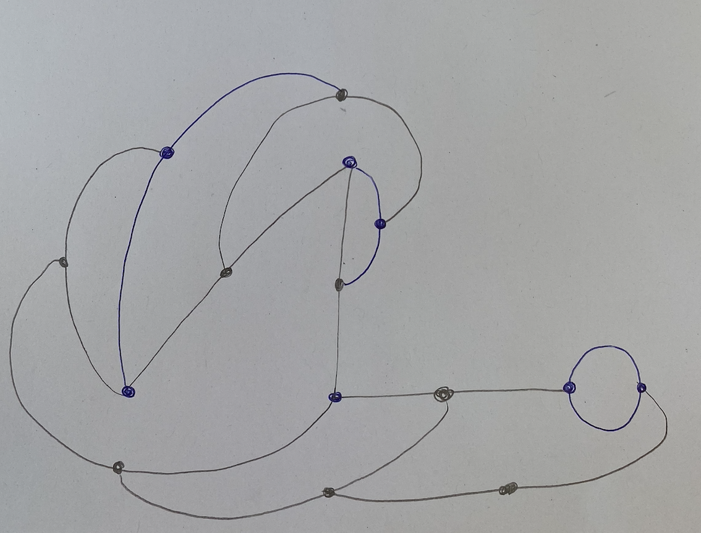

# Day 01 - Getting back into it

## Computing without computer
To start out, we made a few Conditional Designs with pen and paper. This helped me to get my mind back into understanding and thinking about how random things can turn out when certain conditions are given.

## Computing with computer
To get back into coding visuals, I started to draw some simple shapes with Three.js

<iframe src="content/day01/shapes/index.html" width="100%" height="450" frameborder="no"></iframe> 

Then I created a little spinning grid of random blocks.

<iframe src="content/day01/BlockyGrid/index.html" width="100%" height="450" frameborder="no"></iframe> 

# Day 02 - Grids

I first searched for inspiration on the internet. Then I started to create a grid out of cubes. Those cubes I then stretched to create different heights.
Then I positioned the camera at an isometric point of view and changed it to an ortographic projection to create that look.
I used my own shader material so I could set a color for each side of the cube.

For the interactive animations I found the Tween.js library.

<iframe src="content/day02/isometric/index.html" width="100%" height="450" frameborder="no"></iframe> 

After that, I tryed to create some random isometric objects.

<iframe src="content/day02/iso_stature/index.html" width="100%" height="450" frameborder="no"></iframe> 